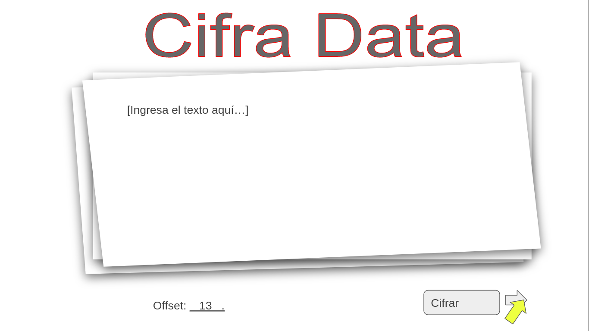
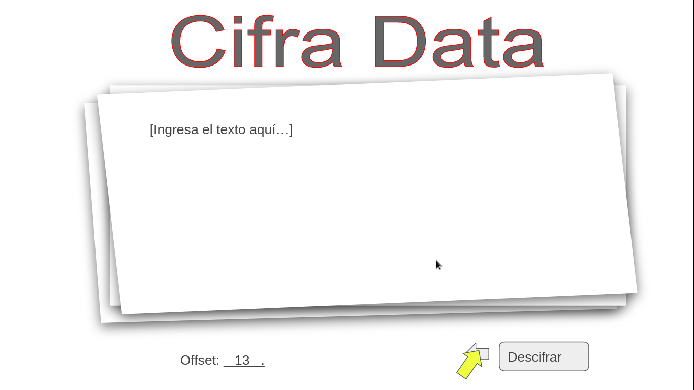
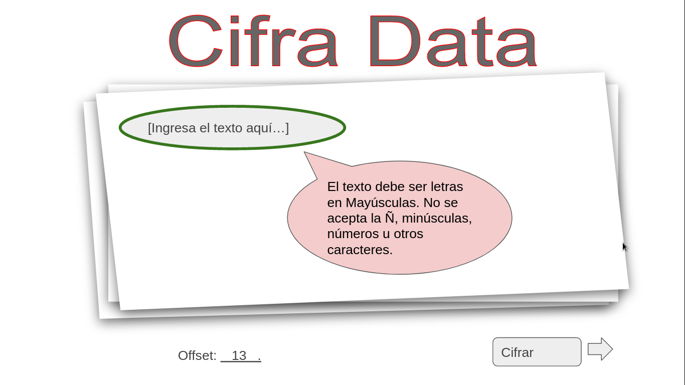
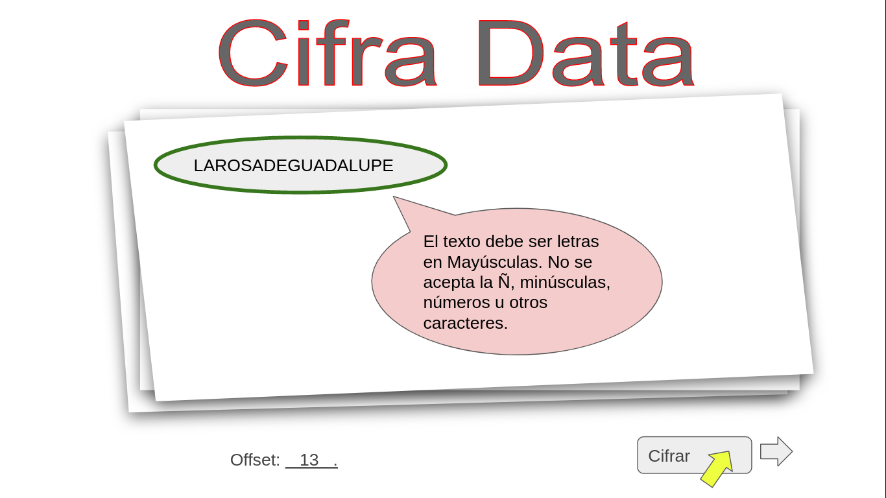
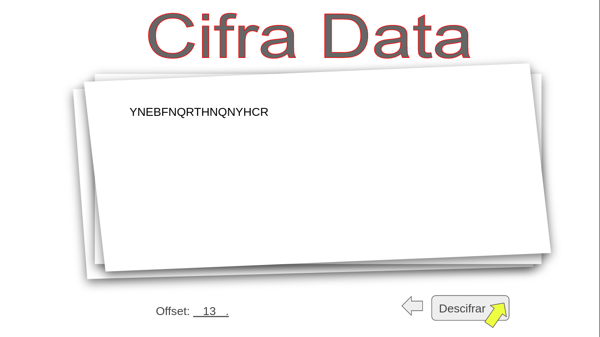
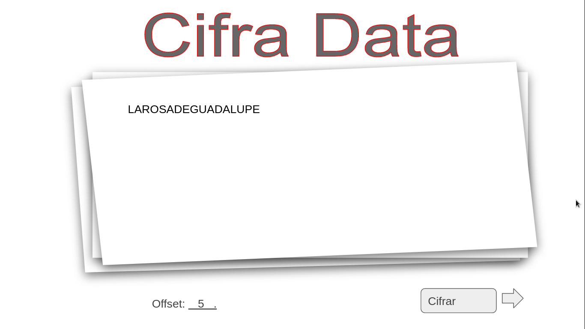
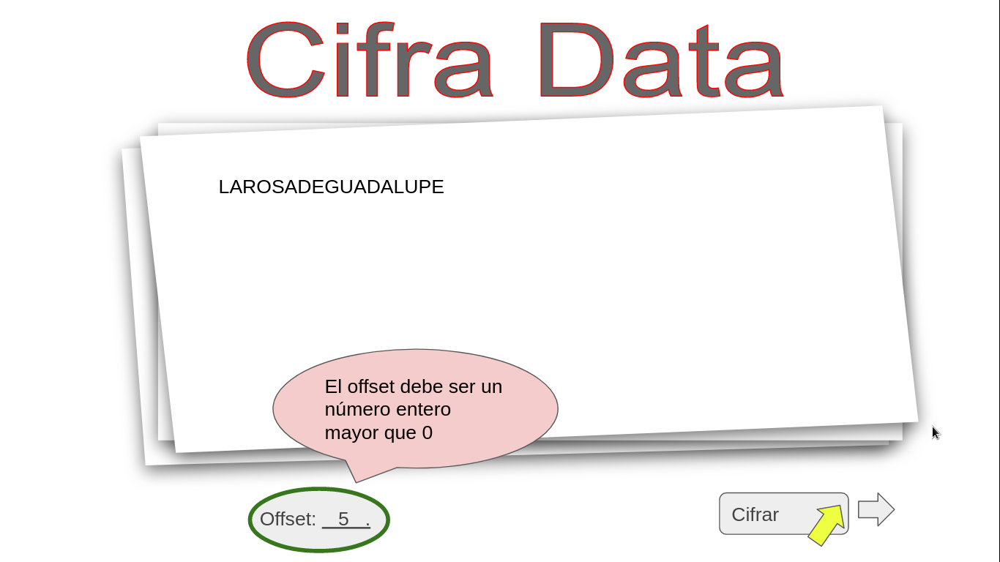
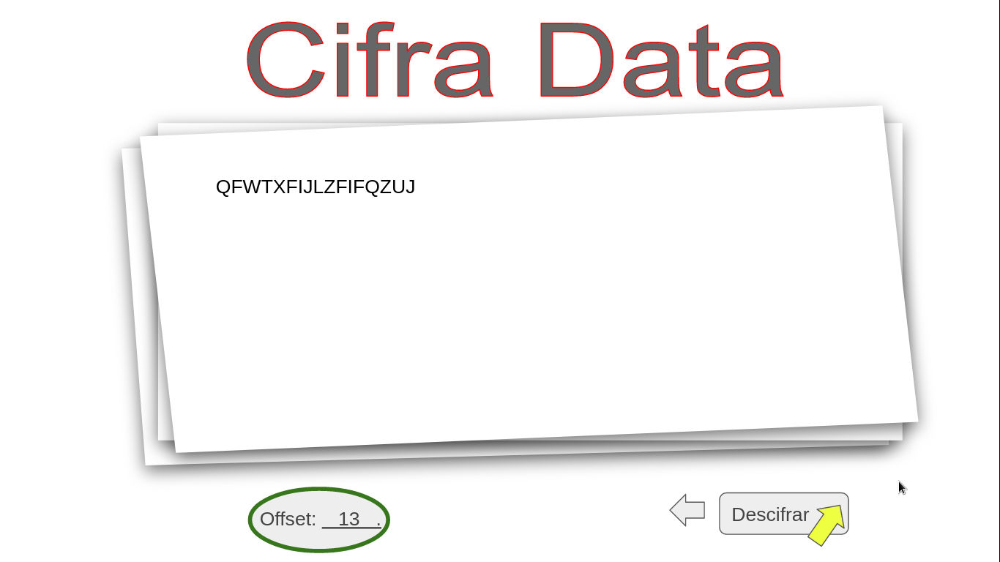
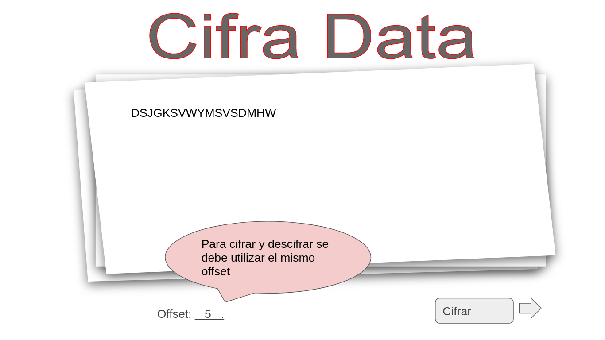

# Cifrado César

## Índice

* [1. Contexto del proyecto](#1-contexto)
* [2. Experiencia de Usuario e Interfaz](#2-experiencia-de-usuario-e-interfaz)
* [3. Requerimientos Funcionales y No Funcionales](#3-requerimientos-funcionales-y-no-funcionales)
* [4. Hitos Opcionales](#4-hitos-opcionales)
* [5. Para considerar Project Feedback](#5-para-considerar-project-feedback)

***

## 1. Contexto

Hoy en día tenemos muchas cuentas en diversas aplicaciones y es fácil olvidar las
contraseñas de ingreso. Por tanto, un servicio importante es poder cifrar y descifrar
tus contraseñas de tal manera que puedas cifrar tu contraseña y guardarla tranquilamente 
en un fichero con extensión *.txt* sin riesgo de ser descifrada por alguna persona que 
no cuente con acceso al número de offset que utilizaste para cifrarla.

Cifrar significa ocultar el contenido de un mensaje a simple vista, de manera
que sólo las partes autorizadas pueden descifrar un texto cifrado.
El [cifrado César](https://en.wikipedia.org/wiki/Caesar_cipher)
es uno de los primeros métodos de cifrado conocidos. El emperador romano Julio
César lo usaba para enviar órdenes secretas a sus generales en los campos de
batalla.

El cifrado césar es una de las técnicas más simples para cifrar un mensaje. Es
un tipo de cifrado por sustitución, es decir que cada letra del texto original
es reemplazada por otra que se encuentra un número fijo de posiciones
(desplazamiento) más adelante en el mismo alfabeto.

Por ejemplo, si usamos un desplazamiento (_offset_) de 3 posiciones:

* La letra A se cifra como D.
* La palabra CASA se cifra como FDVD.
* Alfabeto sin cifrar: A B C D E F G H I J K L M N O P Q R S T U V W X Y Z
* Alfabeto cifrado: D E F G H I J K L M N O P Q R S T U V W X Y Z A B C

En la actualidad, todos los cifrados de sustitución simple se descifran con
mucha facilidad y, aunque en la práctica no ofrecen mucha seguridad en la
comunicación por sí mismos; el cifrado César sí puede formar parte de sistemas
más complejos de codificación, como el cifrado Vigenère, e incluso tiene
aplicación en el sistema ROT13.

#### ¿A quién va dirigido?

A todas las personas que cuenten con acceso a redes sociales, correo electrónico, 
plataformas educativas, registros empresariales, y demás aplicaciones o servidores
en los que se requiera un *login*.

En este proyecto se tiene una aplicación web que servirá para que tu usuaria
pueda cifrar y descifrar un texto en el navegador indicando un desplazamiento
específico de caracteres (_offset_). De esta manera desde adolescentes hasta 
personas de la tercera edad se benefician con este servicio porque ya pueden 
copiar el texto cifrado y pegarlo en un documento para mayor seguridad y sin riesgo
a olvidar las contraseñas.

## 2. Experiencia de Usuario e Interfaz

### 2.1 Comportamiento esperado

La estructura general de la primera vista que ve el usuario es la siguiente:

#### 2.1.1 Historia 1: Poder escoger si codificar o decodificar

Para esto se navega entre las opciones con los botones en forma de flecha
que se ubican a cada lado del botón encargado de **Cifrar** o **Descifrar** el 
mensaje. En primera instancia está habilitada la función de **Cifrar**.

Al hacer click en la flecha hacia la derecha se muestra la opción de **Descifrar**.

Al hacer click en la flecha que apunta hacia la izquierda vuelve a la vista principal o inicial.

#### 2.1.2 Historia 2: Poder codificar un texto

El texto que se quiere codificar debe ser escrito en el recuadro donde dice: *Ingrese el texto aquí...*. En esta parte por 
defecto siempre el offset es igual a 13, pero el usuario tiene la posibilidad de cambiarlo. Las restricciones del texto 
ingresado es que debe ser en mayúsculas y no recibe la *ñ*, minñusculas, nùmeros ni caracteres especiales.

Luego de ingresado el texto que se quiere codificar se da click sobre el botón *Cifrar*. Para este caso, el ejemplo de texto 
es *LAROSADEGUADALUPE* y dejaremos el valor del offset igual a *13*. Luego de hacer click el texto que el usuario ingresó por 
teclado es reemplazado con el nuevo texto cifrado y nos lleva a la vista donde la opción válida para el Botón de funciones es
**Descifrar**. 

#### 2.1.3 Historia 3: Poder decodificar un texto

Para decodificar un texto cifrado desde la pantalla principal se debe hacer click sobre la flecha que apunta hacia la derecha
para ingresar el texto a descifrar.

Una vez ingresado el texto que se quiere decodificar se da click sobre el botón con la funcionalidad **Decodificar** y nos lleva de nuevo a la vista principal, pero en esta ocasión el texto que se quería descifrar es reemplazado por el texto original y el botón de funcionalidad es ahora para **Cifrar**.

#### 2.1.4 Historia 4: Poder escoger un valor de offset para la Codificación

Para este caso y continuando con el ejemplo anterior de *LAROSADEGUADALUPE*, se ingresó un valor de offset de *5*. Luego se procede a dar click sobre el botón *Cifrar* y se obtiene el resultado esperado.

#### 2.1.5 Historia 5: Poder escoger un valor de offset para la Decodificación

Utilizando el texto generado en la historia 4, nuevamente se va a cambiar el valor del offset por 13; de tal manera que, 
al hacer click sobre el botón con la funcionalidad **Descifrar** nos muetra la vista inicial donde el texto a descifrar es
reemplazado por el texto decodificado. Sin embargo, en este caso como el valor de ofset escogido para codificar y decodificar son distintos vemos que el texto decodificado es distinto al que se utilizó en un principio para codificar (*LAROSADEGUADALUPE*).

#### 2.1.6 Historia 6: El usuario ingresa un texto inválido

Para este caso la aplicación verifica el texto ingresado y muestra una alerta indicándole al usuario que el texto ingresado 
contiene caracteres no permitidos o es inválido.

#### 2.1.5 Historia 7: El usuario ingresa un valor de offset negativo o inválido

De igual manera que en la historia 6, se muestra una alerta indicándole al usuario que el valor ingresado no es un nùmero entero mayor que 0 o es un valor inválido.

## 3. Requerimientos Funcionales y No Funcionales

**1. Una interfaz que debe permitir a la usuaria:**

* **Cifrar un mensaje**
  - Insertar el mensaje (texto) que quiere cifrar. El mensaje usa alfabeto
    simplificado (solamente mayúsculas y sin ñ).
  - Elegir un numero de desplazamiento (_offset_) indicando cuántas
    posiciones quieres que el cifrado desplace cada caracter en el alfabeto.
    El numero sera positivo y entero (positive integer).
  - Ver el resultado del mensaje cifrado.

* **Descifrar un mensaje**
  - Insertar el mensaje (texto) que quieres descifrar. El mensaje usa alfabeto
    simplificado (solamente mayúsculas y sin ñ).
  - Elegir un numero desplazamiento (_offset_, que corresponda al que usamos
    para cifrar) indicando cuántas posiciones quieres que
    el cifrado desplace cada caracter en el alfabeto. El numero sera positivo y
    entero (positive integer).
  - Ver el resultado del mensaje descifrado.

**2. Pruebas unitarios de los métodos.**  
Los metódos de `cipher` (`encode` y `decode`) deben tener cobertura con
pruebas unitarias.

**3. Código de tu proyecto subido a tu repo y interfaz "desplegada".**  
El código final debe estar subido en un repositorio en GitHub.  
La interfaz o pagina web, debe ser "desplegada" usando GitHub Pages.

**4. Un README que contiene una definición del producto.**  
En el README cuéntanos cómo pensaste en los usuarios y cuál fue tu proceso
para definir el producto final a nivel de experiencia y de interfaz. Estas
preguntas sirven como guia:

* Quiénes son los principales usuarios de producto
* Cuáles son los objetivos de estos usuarios en relación con tu producto
* Cómo crees que el producto que estás creando está resolviendo sus problemas

## 4. Hitos Opcionales: 

*1. Agrega soporte para ñ, minúsculas, números y otros caracteres*

*2. Permitir cargar ficheros con extensión **.txt** para descifrar su contenido*  

*3. Permitir escribir un fichero con extensión **.txt** para guardar el texto cifrado*  

## 5. Para considerar Project Feedback

En resumen, los criterios de aceptación mínimos del proyecto para considerar
Project Feedback:

* [ ] Tiene una interfaz que permite a la usuaria cifrar y descifrar.
* [ ] El proyecto será entregado incluyendo pruebas unitarios de los métodos de `cipher`
(`encode` y `decode`).
* [ ] El proyecto será entregado libre de _errores_ de `eslint` (_warnings_ son ok).
* [ ] El proyecto será entregado subiendo tu código a GitHub.
* [ ] La interfaz será "desplegada" usando GitHub Pages.
* [ ] El README contiene una definición del producto.

## 6. Documentación y Herramientas adicionales utilizadas

* Se creó un tablero de [Project 1 - Cipher in Trello](https://trello.com/invite/b/96ys0Mn4/ATTI6b8d992774ca310bcd278605f1ebe2214CA3BB25/project-1-cipher) para adminsitrar y definir el *backlog* del proyecto y del *Sprint 1*. 
* Se utilizó [Gimp](https://www.gimp.org/) y *Power Point* para realizar y detallar las imágenes presentadas.
* Se utilizó una [IA](https://you.com) para preguntar y resolver dudas conceptuales sobre temas de los OA's del proyecto.
* Se utilizó [Stack Over Flow](https://es.stackoverflow.com/) para consultar inconvenientes puntuales y entender cómo solucionarlos.
* Diagrama de flujo realizado en [Figma](https://www.figma.com/file/Pmr8XnhtL6ELkBE6jxxwLK/Untitled?type=whiteboard&node-id=0%3A1&t=VByZsGsaOp94pb3C-1)
